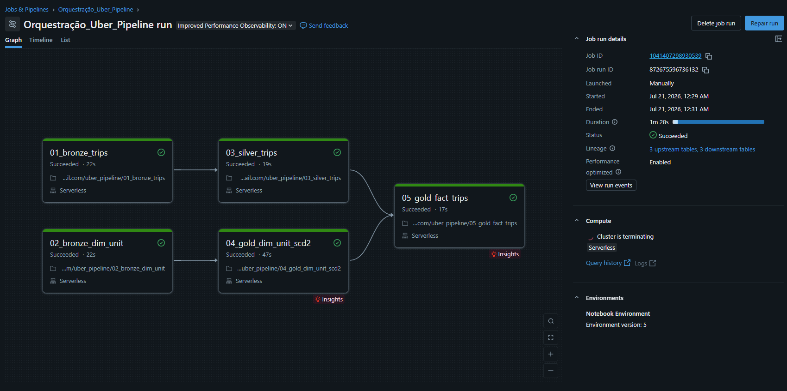

# Uber Central - Pipeline Medalhão em Databricks

Pipeline de dados construído no Databricks (PySpark + Delta Lake + Unity Catalog) replicando, em outro motor de processamento, a arquitetura que mantenho em produção em Oracle: ingestão incremental, tratamento de qualidade de dado e uma dimensão com histórico versionado (SCD Type 2).

O objetivo aqui não foi aprender Spark do zero num tutorial genérico. É pegar problemas que eu já resolvi de verdade num ambiente (incidente de reconciliação financeira, corte de dia mal tratado, dimensão sem controle de vigência) e provar que sei resolver a mesma classe de problema em Auto Loader / Delta Lake, sem depender do Oracle.

Nenhum dado real da empresa onde trabalho foi usado. Todo o dataset é sintético, gerado com anomalias propositais (ver seção "Dataset sintético" abaixo), para simular exatamente os cenários de erro que eu precisava tratar.

## Por que esse projeto existe

Minha stack principal é Oracle + PL/SQL + Apache Airflow. É sólida, mas 100% on-premise. As vagas de engenharia de dados que hoje me interessam pedem PySpark, Delta Lake e processamento distribuído — tecnologia que eu não uso no dia a dia. Em vez de fechar essa lacuna com um projeto de dataset público (tipo Titanic ou e-commerce fake), decidi portar a lógica de negócio de um pipeline que já opero de verdade (integração Uber Central da empresa) para Databricks, mantendo a estrutura de dado e os tipos de problema reais, mas com dado 100% sintético.

## Arquitetura

O catálogo Unity Catalog `uber_pipeline` é organizado em 4 schemas, um por camada, seguindo uma convenção de nomenclatura simples: o schema já comunica a camada, então o nome da tabela não repete o prefixo (`bronze.daily_trips`, não `bronze.bronze_daily_trips`).

```
uber_pipeline
|-- bronze   (dado bruto, como veio da fonte)
|     |-- daily_trips           <- Auto Loader, ingestao incremental (schema inferido, sem DDL fixo)
|     \-- dim_unit_snapshots    <- leitura batch, snapshots periodicos da dimensao
|
|-- silver   (dado limpo e reconciliado)
|     |-- daily_trips           <- dedup por trip_uuid + correcao de event_date (schema herdado da Bronze)
|     \-- dim_unit              <- limpeza/validacao/dedup da dimensao (contrato fixo)
|
|-- gold     (modelo dimensional final)
|     |-- dim_unit              <- SCD Type 2 incremental, sk_unit via IDENTITY
|     \-- fact_trips            <- fato com join temporal contra a dimensao
|
\-- control  (metadado de orquestracao, nao e dado de negocio)
      \-- processed_snapshots   <- guarda de idempotencia da Gold (snapshot_date + source_table ja processados)
```

`00_architecture.py` concentra todo o DDL do catálogo (catalog, schemas, volumes, tabelas) e é idempotente — `IF NOT EXISTS` em tudo, seguro rodar quantas vezes quiser. Nenhum outro notebook cria tabela, schema ou volume. Duas exceções deliberadas: `bronze.daily_trips` e `silver.daily_trips` não têm DDL fixo — o schema é inferido da fonte (Auto Loader / append da Bronze), não é contrato de engenharia, então a tabela nasce implicitamente no primeiro `write` do próprio notebook de ETL.

Cada camada é um notebook separado, não um notebook monolítico. Mesma lógica que já aplico no Airflow separando DAGs por fonte (`dag_teknisa`, `dag_meta`, `dag_gold_master`) — reprocessar a dimensão não deveria obrigar reprocessar o fato inteiro, e vice-versa.

Os notebooks são orquestrados via Databricks Workflows, com dependência explícita em grafo, não em sequência linear: `01_bronze_trips` e `02_bronze_dim_unit` rodam em paralelo (não dependem um do outro), convergindo em `03_silver_trips` e `03b_silver_dim_unit` respectivamente, que por sua vez alimentam `04_gold_dim_unit_scd2` e depois `05_gold_fact_trips` (que depende dos dois ramos). É o mesmo desenho de dependência que já uso com Airflow Datasets, só que declarado na UI do Job em vez de código.



### Por que existe uma Silver para a dimensão de unidade

As trips têm uma Silver dedicada porque a fonte chega suja (duplicidade, corte de fuso). Os snapshots da dimensão de unidade são bem menores (~15 linhas hoje) e muito mais limpos — dava pra argumentar que uma Silver ali seria burocracia sem função. Decidi manter a camada mesmo assim, por dois motivos práticos: (1) mesmo um dataset pequeno pode ter nulo em campo obrigatório ou registro duplicado vindo da origem, e eu quero um lugar único e explícito para descartar isso, com log de quantas linhas foram descartadas, sem misturar validação de qualidade com a lógica de versionamento SCD2; (2) pular direto de Bronze pra Gold quebraria a simetria da arquitetura — toda dimensão e todo fato passam pelas mesmas 4 camadas, sem exceção ad-hoc por "esse dataset é pequeno". `03b_silver_dim_unit` faz exatamente isso: valida nulos nos campos obrigatórios (descarta e loga, não falha o notebook), dedup por `(unit_code, snapshot_date)` mantendo a ingestão mais recente, e grava com `overwrite` completo — decisão deliberada, não preguiça: se o histórico de snapshots crescer muito, revisitar para incremental.

## Dataset sintético

Os arquivos de trips (`daily_trips-YYYY_MM_DD.csv`) simulam 90 dias de operação, com três anomalias injetadas de propósito:

- **Arquivo faltante** em 2 dias, simulando falha de carga/SFTP.
- **Duplicidade** de ~8% dos registros em 5 dias, simulando reprocessamento indevido de arquivo.
- **Corte de fuso/dia**: corridas entre 23:45 e 23:59 gravadas no arquivo do dia seguinte, mas com a data do evento (`request_date`/`pickup_datetime`) mantendo o dia correto. Isso replica, de forma controlada, o mesmo tipo de divergência entre "arquivo de chegada" e "data do evento" que causou uma discrepância de R$ 141 num fechamento real que precisei investigar e corrigir.

A dimensão de unidade (`dim_unit_snapshot-YYYY_MM_DD.csv`) simula 3 extrações completas (equivalente a um extrato periódico do sistema de origem), com duas mudanças propositais de atributo entre elas — transferência de centro de custo (`cost_center`) e uma reorganização (nome + região). O gabarito completo de cada anomalia está documentado em `ANOMALIES.md` e `DIM_UNIT_ANOMALIES.md`, usado para validar se cada camada tratou o problema certo.

## Decisões técnicas e por quê

**Schema explícito em vez de inferência automática.** A primeira versão do pipeline usava `inferSchema`/`inferColumnTypes` e isso corrompeu silenciosamente a chave `unit_code` — códigos como `01001` viraram o inteiro `1001`, perdendo o zero à esquerda. Sem validação linha a linha isso teria passado despercebido até o join da Gold falhar sem erro nenhum (silenciosamente não casando nada, ou pior, casando errado). Corrigi com `cloudFiles.schemaHints` no Auto Loader (força o tipo de uma coluna específica sem desabilitar a evolução de schema automática do resto) e com `StructType` explícito na leitura batch da dimensão. Isso virou regra que eu aplico agora por padrão: qualquer campo que pareça número mas seja código de negócio nunca fica com tipo inferido.

**Auto Loader nas trips, leitura batch simples na dimensão.** As trips chegam como fluxo incremental diário — faz sentido pagar o overhead de checkpoint e schema evolution do Auto Loader. A dimensão são só alguns snapshots pontuais; usar Auto Loader ali seria complexidade sem ganho.

**Silver de trips incremental via Structured Streaming, não overwrite completo.** A primeira versão da Silver recomputava tudo do zero a cada execução a partir da Bronze inteira — funcionava, mas jogava fora o próprio motivo de existir do Auto Loader (processar só o que é novo) assim que chegava na camada seguinte. Troquei para `readStream.table("bronze.daily_trips")` com `foreachBatch` e `trigger(availableNow=True)`: cada microbatch faz dedup por `trip_uuid` (mantendo a ingestão mais recente via `row_number`), corrige `event_date` com `to_date(pickup_datetime)` — resolvendo o corte de dia a partir da data real da corrida, não do arquivo de origem — e faz `MERGE` com `whenNotMatchedInsertAll` contra `silver.daily_trips`. É insert-only de propósito: a Silver nunca atualiza uma trip já existente, só acrescenta as que ainda não foram vistas.

**Surrogate key da Gold via `IDENTITY`, não hash determinístico.** A primeira versão usava `sha2(unit_code + valid_from)` como SK, porque naquele momento a Gold inteira era recompute completo (`DROP TABLE` + `CREATE TABLE` a cada execução) e uma sequência autoincremento geraria valores diferentes cada vez que a tabela fosse recriada do zero. Ao trocar a Gold para incremental de verdade (ver próximo item), esse problema desaparece — a tabela nunca mais é recriada, só recebe `MERGE`/`INSERT` sobre o estado que já existe — e `sk_unit BIGINT GENERATED ALWAYS AS IDENTITY` passa a ser a opção mais simples e correta, sem precisar calcular hash nenhum.

**Idempotência da Gold da dimensão via `control.processed_snapshots` + `content_hash`, dupla guarda.** A primeira versão da Gold só comparava contra o estado atual (`is_current`), nunca contra "esse snapshot já foi processado alguma vez?". Rodar o mesmo snapshot duas vezes duplicava histórico: `01001` e `02002` (as únicas unidades com mudança de atributo) chegaram a acumular versões demais, e a fato, que faz join contra a dimensão, herdava a multiplicação. A correção tem duas camadas independentes:
1. **`control.processed_snapshots`** guarda quais `(snapshot_date, source_table)` já foram processados. `04_gold_dim_unit_scd2` descobre os snapshots pendentes com `left_anti` contra essa tabela; se não há nada novo, `dbutils.notebook.exit()` encerra sem tocar em `gold.dim_unit`. O registro de controle só é gravado depois que o `MERGE`/`INSERT` daquele snapshot específico teve sucesso — se a célula quebrar no meio, aquele snapshot fica pendente e é reprocessado na próxima execução, que é o comportamento desejado.
2. **`content_hash`** (`sha2` sobre os atributos de negócio — `unit_name`, `region`, `cost_center` — nunca sobre `unit_code`/`valid_from`) é uma segunda guarda: mesmo que o controle de snapshot falhasse por algum motivo, o `MERGE` só fecha a versão vigente (`valid_to`, `is_current = false`) quando o conteúdo de negócio realmente mudou, não a cada execução.

Com as duas guardas, rodar o mesmo snapshot duas vezes é um no-op: nenhuma versão nova é criada, nenhum `valid_to` é sobrescrito.

**A dimensão de unidade agora passa por uma Silver própria**, ver seção "Por que existe uma Silver para a dimensão de unidade" acima — decisão que mudou no meio do projeto junto com o resto da idempotência da Gold.

**Join temporal na fato, não join simples por chave de negócio.** Esse é o ponto mais importante do projeto. `gold.dim_unit` guarda várias versões da mesma unidade ao longo do tempo. Se o join do fato com a dimensão usasse só `unit_code = unit_code`, cada corrida bateria com todas as versões da unidade, ou (filtrando só a versão vigente) toda corrida herdaria o atributo *atual* da dimensão, mesmo que tivesse acontecido num período em que o atributo era outro. É a mesma classe de erro que gera `ORA-30926` nas minhas procedures reais quando uma dimensão SCD2 é usada num MERGE ou join sem filtro de vigência. A correção foi comparar a data do evento contra o intervalo `valid_from`/`valid_to` da dimensão, tratando o `NULL` de `valid_to` (versão ainda vigente) com `COALESCE` para uma data futura, permitindo que a comparação funcione tanto para versões expiradas quanto para a corrente.

## Validação

Toda alteração de camada foi validada com query, não só "rodou sem erro":

- Arquivo faltante: `LEFT ANTI JOIN` entre calendário completo e datas presentes em Bronze confirma exatamente os 2 dias esperados, nem mais nem menos.
- Duplicidade: `COUNT(*) > 1` por `trip_uuid` retorna 0 linhas em Silver, confirmando que o dedup por `ROW_NUMBER()` funcionou.
- Corte de fuso: cruzamento de `_source_file` contra `request_date`/`event_date` confirma que o arquivo físico (D+1) e a data do evento (D) divergem exatamente nos dias esperados em Bronze, e que `event_date` reconcilia isso corretamente em Silver.
- SCD2: a unidade `01001` (mudança de um único atributo) e `02002` (mudança de dois atributos simultâneos) geraram exatamente 2 versões cada, com `valid_from`/`valid_to` corretos; as demais unidades, sem mudança, mantiveram 1 versão só (controle negativo).
- Join temporal: a mesma unidade (`01001`), em datas diferentes, retorna `sk_unit` e atributos diferentes na fato — uma corrida de abril traz o centro de custo antigo, uma corrida de maio traz o novo, provando que o join pegou a versão vigente na data do evento, não a versão atual.
- `gold.fact_trips`: `COUNT(*)` bate com `silver.daily_trips` (8402) e 0 linhas com `sk_unit IS NULL` — nenhuma trip ficou sem dimensão correspondente.

### Teste de idempotência (rodar 2x, mesmo resultado)

O ponto central da migração para incremental foi provar que rodar o mesmo notebook mais de uma vez não duplica nem corrompe nada, sem depender de recompute completo:

- **`03_silver_trips`**, rodado 2 vezes seguidas: `COUNT(*) = COUNT(DISTINCT trip_uuid) = 8402` nas duas execuções. Se o `MERGE` insert-only tivesse alguma brecha, a segunda rodada teria inflado a contagem.
- **`04_gold_dim_unit_scd2`**, rodado 2 vezes seguidas: contagem de versões por `unit_code` idêntica nas duas execuções — `01001 = 2`, `02002 = 2` (as unidades com mudança real de atributo), `01002 = 1`, `01003 = 1`, `02001 = 1` (controle negativo, sem mudança). A segunda execução não encontra snapshot pendente em `control.processed_snapshots` e sai sem tocar em `gold.dim_unit`.

## Estrutura do repositório

```
docs/
  job_orchestration_graph.png   - grafo de dependencia do Job
notebooks/
  00_architecture.py            - DDL centralizado e idempotente (catalog, schemas, volumes, tabelas)
  01_bronze_trips.py            - Auto Loader, schema explicito via schemaHints
  02_bronze_dim_unit.py         - leitura batch dos snapshots de dimensao, anti-join contra o que ja existe
  03_silver_trips.py            - Structured Streaming incremental, dedup + event_date reconciliado
  03b_silver_dim_unit.py        - limpeza/validacao/dedup da dimensao antes da Gold
  04_gold_dim_unit_scd2.py      - SCD Type 2 incremental (control.processed_snapshots + content_hash)
  05_gold_fact_trips.py         - fato final, join temporal contra a dimensao
data_generation/
  gerar_dados_uber_trips.py     - gerador do dataset sintetico de trips, com anomalias
  gerar_dados_uber_units.py     - gerador dos snapshots da dimensao de unidade
  ANOMALIES.md                  - gabarito das anomalias de trips
  DIM_UNIT_ANOMALIES.md         - gabarito das mudancas historicas da dimensao
```

## Próximos passos

- Estender o join temporal para considerar múltiplas dimensões versionadas ao mesmo tempo (hoje só `dim_unit` tem SCD2).
- Adicionar teste automatizado (não só query manual) que rode o gabarito de anomalias como parte do próprio Job.
- Avaliar particionamento/otimização (`OPTIMIZE`, `ZORDER`) em `silver.daily_trips` e `gold.fact_trips` conforme o volume de dados crescer além do dataset sintético atual.
